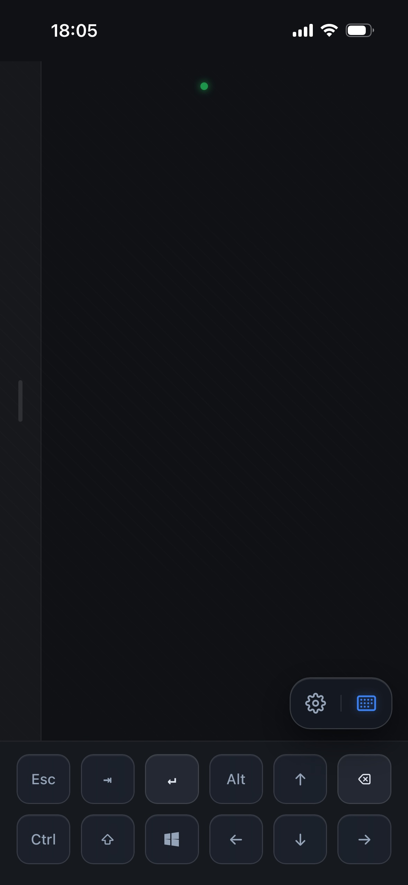
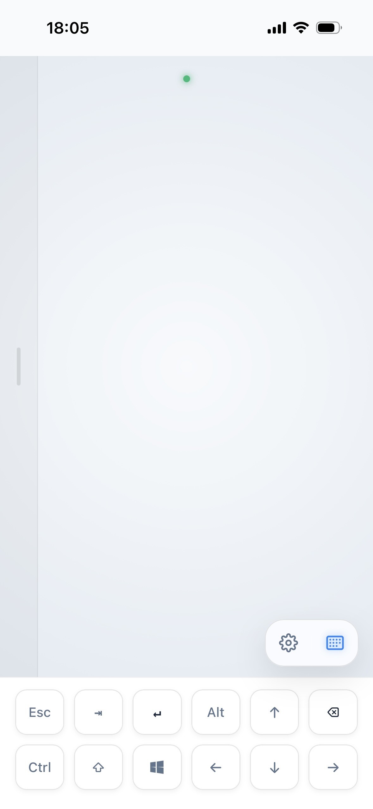
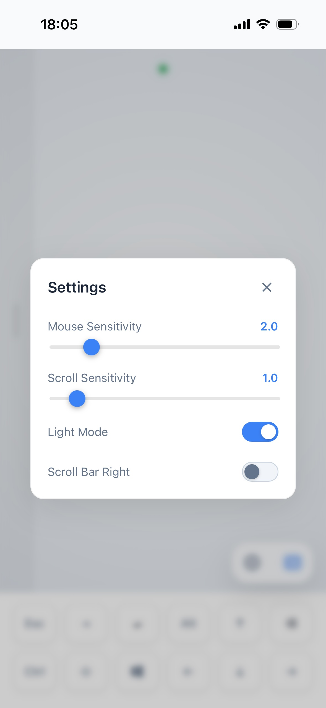

#  Remote Mouse

[English](README.md) | [简体中文](docs/README_ZH.md)

  

  
  
  

---

Remote Mouse is a lightweight, low-latency remote control tool that transforms your mobile device into a wireless touchpad and keyboard for your computer (Windows/macOS/Linux).

### Features

- **PWA Support**: Install the web client as a native app on your phone for a full-screen experience.
- **Auto Discovery**: Automatically finds servers in the local network using mDNS.
- **Headless & Tray-only**: Runs as a lightweight background service with a system tray icon.
- **Low Latency**: High-performance Rust server ensures smooth cursor movement and input response.
- **Full Keyboard Input**: Supports text input, function keys (Esc, Tab, Enter), and modifier keys (Ctrl, Alt, Shift, Win).
- **Cross-Platform**: Built with Rust and Tauri for native performance on Windows, macOS, and Linux.

### Download & Run (For Users)

Get the latest version from the [Releases](https://github.com/rust17/remote-mouse/releases) page.

#### Windows
1. Download the `.msi` or `.exe` installer.
2. Run the installer and launch the application.
3. Look for the Remote Mouse icon in your **System Tray**.

#### macOS
1. Download the `.dmg` file and drag Remote Mouse to your Applications folder.
2. Launch the app. It will appear in your **Menu Bar**.
3. **Grant Permissions**: Go to `System Settings` > `Privacy & Security` > `Accessibility` and enable `Remote Mouse`. This is required for the server to control the mouse and keyboard.

#### Linux
1. Download the `.deb` or `.AppImage`.
2. Install the package or make the AppImage executable.
3. Launch the app and check your system tray.

---

### Development

For technical details and development instructions, please refer to [AGENTS.md](AGENTS.md).

### Usage
1. Start the server on your computer.
2. Ensure your phone and computer are on the **same local network (Wi-Fi)**.
3. Open the access address in your mobile browser:
   - **http://remote-mouse.local:9997**
4. (Optional) "Add to Home Screen" to install as a PWA for a better experience.
5. Start controlling!
