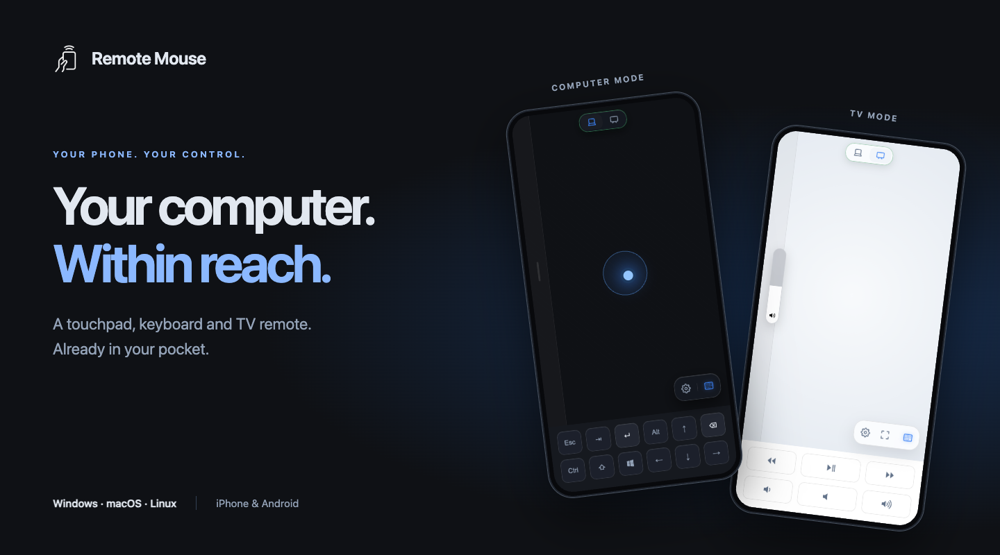
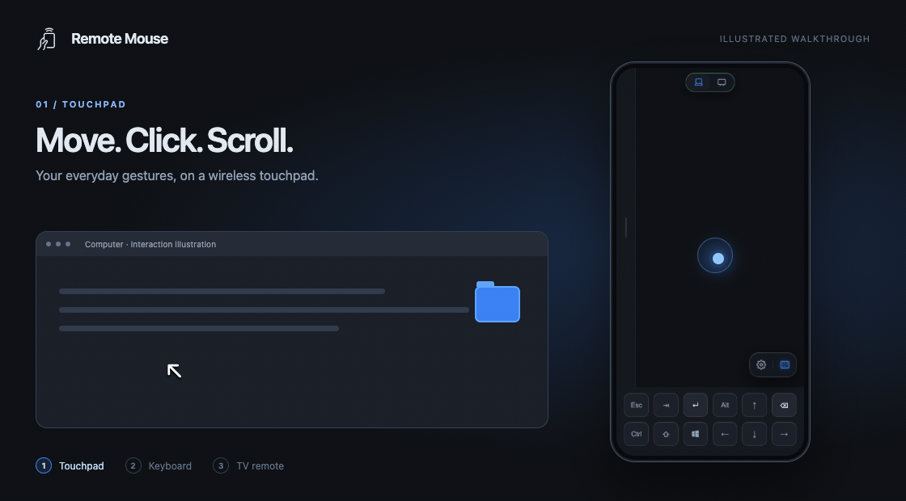
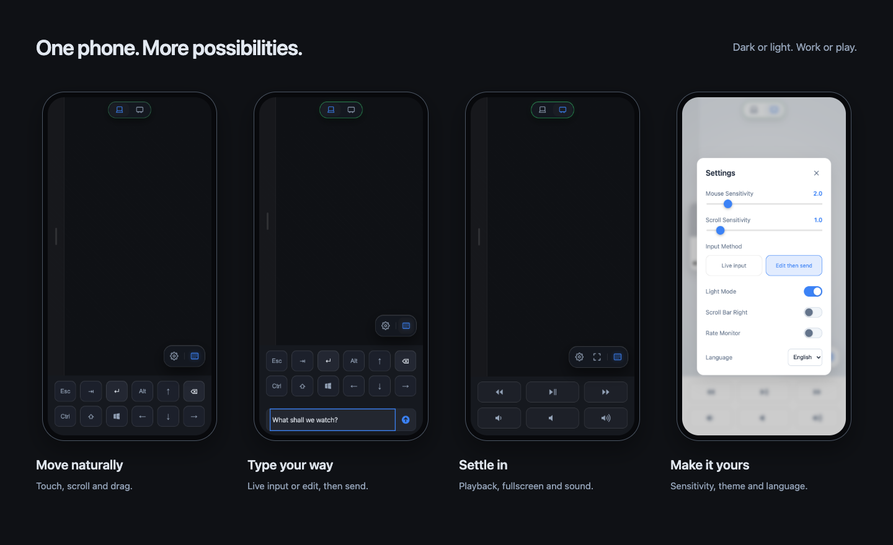

<h1 align="center">Remote Mouse</h1>

  Your phone, now a wireless touchpad, keyboard and TV remote.

  <a href="https://github.com/rust17/remote-mouse/releases">Download for your computer</a> ·
  <a href="#get-started">Get started</a> ·
  <a href="docs/README_ZH.md">简体中文</a>

  

Control your computer from your phone — at your desk, during a presentation, or from the sofa. Install Remote Mouse on your computer and open it in your phone’s browser. **No phone app required.**

Works with **iPhone and Android**, and **Windows, macOS and Linux** computers.

| A wireless touchpad | A keyboard in your pocket | A remote for movie night |
| --- | --- | --- |
| Move, click, scroll and drag with familiar gestures. | Type live, or write a draft and send it when ready. | Switch to TV mode for playback, fullscreen, volume and mute. |

  

Illustrated walkthrough using the current interface.

Explore the interface — touchpad, typing, TV and settings

  

Choose a light or dark theme, adjust pointer and scrolling sensitivity, and place the scroll strip on either side. The interface is available in English and Chinese.

## Get started

1. **On your computer:** [download Remote Mouse](https://github.com/rust17/remote-mouse/releases), install it and keep it running. On macOS, enable its **Accessibility** permission; Linux needs an **X11** desktop. See the installation notes below.
2. **On your phone:** connect to the same Wi-Fi network as your computer.
3. **Open your browser:** visit [http://remote-mouse.local:9997](http://remote-mouse.local:9997).

If the address does not open, use your computer’s IP address instead, such as `http://192.168.1.10:9997`. Find it in the Remote Mouse tray menu on Windows/macOS, or in your computer’s network settings.

If your browser offers **Add to Home Screen**, use it for quicker access. Keep your computer on and Remote Mouse running while you use it.

Installation notes for Windows, macOS and Linux

### Install on your computer

Download the file for your computer from the [download page](https://github.com/rust17/remote-mouse/releases).

#### Windows

1. Download the file ending in `-setup.exe` and install it.
2. Open **Remote Mouse** from the Start menu.
3. If the firewall asks, allow access on private networks.

For a version that needs no installation, download `-portable.zip`, extract the whole folder and run `RemoteMouse.exe`. Keep the files together.

#### macOS

1. For an M-series Mac, choose `macos-arm64`; for an Intel Mac, choose `macos-x86_64`.
2. Open the downloaded file, drag **RemoteMouse** into Applications and launch it. Look for its icon in the menu bar.
3. Go to **System Settings > Privacy & Security > Accessibility** and enable RemoteMouse. This lets it control your mouse and keyboard.

If macOS blocks the app on first launch, confirm that you downloaded it from this project, then allow it to open in **Privacy & Security**.

#### Linux

Extract `linux-x86_64.tar.gz` and run `RemoteMouse` from the extracted folder. Use an X11 desktop; Wayland is not supported. The included `README.txt` explains any extra components your system needs. To restart the app, close it and open it again.

## Everyday controls

Choose the **computer icon** for everyday use or the **TV icon** for watching videos. Both modes share the same touchpad and keyboard.

Gestures, keyboard and TV controls

### Mouse and keyboard

| Gesture | What it does |
| --- | --- |
| Slide one finger | Move the pointer |
| Tap once | Left click |
| Tap with two fingers | Right click |
| Slide two fingers | Scroll |
| Slide on the side strip | Scroll with one finger |
| Slide three fingers | Drag; lift a finger to release |

Tap the **keyboard icon** to type. **Live input** appears on the computer as you type. **Edit then send** lets you prepare the text on your phone and tap Send when it is ready. In this mode, Enter confirms on the computer; use Send to transfer the text.

Switching modes or opening settings closes the keyboard panel. Your unsent draft stays available until you send it or reload the page.

The **settings icon** lets you change sensitivity, the side strip’s position, theme and language. A green ring around the mode buttons means connected, yellow means connecting, and red means disconnected.

### TV mode

- **Play / pause**: Uses the player’s Space shortcut.
- **Rewind / forward**: Uses the player’s left/right arrow shortcuts. How far it skips depends on the player.
- **Fullscreen**: Double-clicks where the computer pointer is. Press again to leave fullscreen if your player supports it.
- **Volume − / +**: Changes the computer’s volume by 5 points and turns sound back on if muted.
- **Mute**: Turns the computer’s sound off or back on.

Need a hand? Connection, permissions and video controls

- **The page will not open**: Check that the app is running, both devices are on the same network, and the computer’s firewall allows access. Try the computer’s IP address instead of the `.local` address.
- **The pointer or keyboard does not respond**: On macOS, check the Accessibility permission. On Windows, controlling an app opened as administrator also requires opening Remote Mouse as administrator.
- **Video controls do nothing**: Click the player on the computer again. Check that Space, arrow keys and a double click work in that player.
- **Some buttons are greyed out**: That control is unavailable. For volume, check that the computer has an audio output; on Linux, follow the sound setup in the included `README.txt`. Updating the computer app may help if it is an older version.
- **Sharing an error report**: Turn on **Debug Mode** in settings, then tap the floating console and take a screenshot of the error. If settings will not open, add `?debug=1` to the page address (or `&debug=1` if it already contains `?`).

## For developers

See the [project guide](AGENTS.md) for source setup and tests, and the [packaging guide](packaging/README.md) for building and releasing the app.
