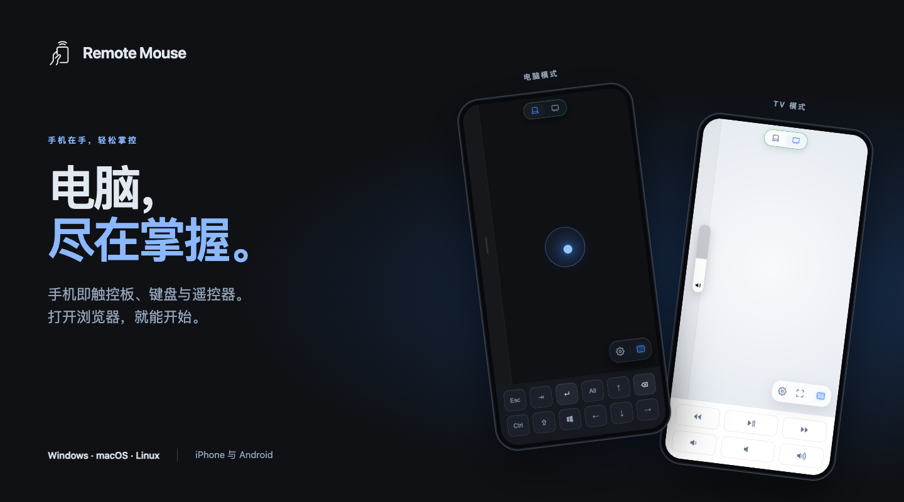
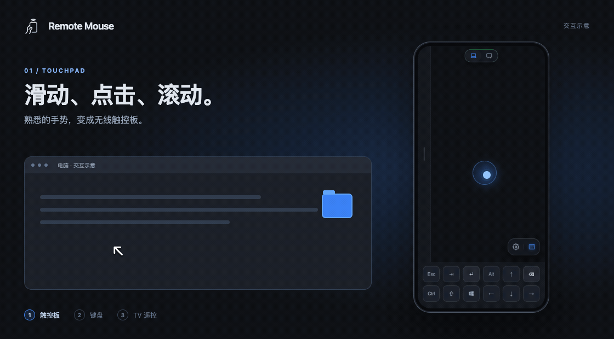

<h1 align="center">Remote Mouse</h1>

  把手机变成无线触控板、键盘与 TV 遥控器。

  <a href="https://github.com/rust17/remote-mouse/releases">下载电脑端</a> ·
  <a href="#开始使用">开始使用</a> ·
  <a href="../README.md">English</a>

  

坐在桌前、演示时，或窝在沙发里，都能用手机操作电脑。在电脑上安装 Remote Mouse，再用手机浏览器打开网页。**手机无需安装应用。**

支持 **iPhone、Android** 手机，以及 **Windows、macOS、Linux** 电脑。

| 无线触控板 | 随身键盘 | 观影遥控器 |
| --- | --- | --- |
| 用熟悉的手势移动、点击、滚动与拖拽。 | 实时输入，或先写好草稿，再整段发送。 | 切换 TV 模式，控制播放、全屏、音量与静音。 |

  

使用当前界面制作的交互示意。

看看当前界面：触控板、文字输入、TV 与设置

  

深色或浅色随你选择，鼠标和滚动灵敏度可以调节，侧边滚动条也能放在左侧或右侧。界面支持中文和英文。

## 开始使用

1. **电脑端：**[下载 Remote Mouse](https://github.com/rust17/remote-mouse/releases)，安装并保持运行。macOS 需要启用**辅助功能**权限；Linux 需要使用 **X11** 桌面。具体方法见下方安装说明。
2. **手机端：**让手机和电脑连接同一个 Wi-Fi 网络。
3. **打开浏览器：**访问 [http://remote-mouse.local:9997](http://remote-mouse.local:9997)。

如果打不开，改用电脑的 IP 地址，例如 `http://192.168.1.10:9997`。Windows/macOS 可在 Remote Mouse 托盘菜单中查看，也可在电脑的网络设置中查看。

如果浏览器提供**添加到主屏幕**，可以添加后从手机桌面打开。使用期间，电脑需要保持开机，Remote Mouse 也需要保持运行。

Windows、macOS 与 Linux 安装说明

### 在电脑上安装

前往[下载页面](https://github.com/rust17/remote-mouse/releases)，选择适合自己电脑的文件。

#### Windows

1. 下载以 `-setup.exe` 结尾的文件并安装。
2. 从开始菜单打开 **Remote Mouse**。
3. 防火墙询问时，允许专用网络访问。

想免安装使用，可下载 `-portable.zip`，完整解压后运行 `RemoteMouse.exe`，请保留文件夹中的全部文件。

#### macOS

1. M 系列芯片的 Mac 选择 `macos-arm64`，Intel 芯片选择 `macos-x86_64`。
2. 打开下载的文件，将 **RemoteMouse** 拖入 Applications（应用程序）并启动，图标会出现在菜单栏。
3. 在 **系统设置 > 隐私与安全性 > 辅助功能** 中启用 RemoteMouse，允许它操作鼠标和键盘。

若首次打开被 macOS 拦截，请确认文件来自本项目，再到 **隐私与安全性** 中允许打开。

#### Linux

解压 `linux-x86_64.tar.gz`，运行文件夹内的 `RemoteMouse`。需要使用 X11 桌面，不支持 Wayland。系统需要额外安装的组件见包内 `README.txt`。重启应用时，关闭后重新打开即可。

## 日常操作

点击顶部的**电脑图标**进行日常操作，点击 **TV 图标**遥控视频。两个模式共用触控板和键盘。

手势、键盘与 TV 控制

### 鼠标和键盘

| 手势 | 作用 |
| --- | --- |
| 单指滑动 | 移动光标 |
| 轻点一次 | 左键点击 |
| 双指轻点 | 右键点击 |
| 双指滑动 | 滚动页面 |
| 滑动侧边滚动条 | 用一根手指滚动 |
| 三指滑动 | 拖拽，抬起一指后释放 |

点击**键盘图标**开始打字。**实时输入**会把输入内容直接传到电脑；**编辑后发送**可以先在手机上写好，再点击发送。这种方式下，回车用于在电脑上确认，发送文字请点击发送按钮。

切换模式或打开设置会收起键盘面板。未发送的草稿会保留，直到发送或重新加载页面。

点击**设置图标**可以调整灵敏度、侧边滚动条位置、主题和语言。顶部模式按钮的外圈为绿色表示已连接，黄色表示连接中，红色表示已断开。

### TV 模式

- **播放 / 暂停**：使用播放器的空格快捷键。
- **快退 / 快进**：使用播放器的左、右方向键，跳转多少由播放器决定。
- **全屏**：在电脑光标所在位置双击；播放器支持时，再点一次可退出全屏。
- **音量 − / +**：每次调整电脑音量 5 个百分点，静音时会恢复声音。
- **静音**：关闭或恢复电脑声音。

遇到问题？连接、权限与视频控制

- **网页打不开**：检查应用是否运行、手机和电脑是否在同一网络，以及电脑防火墙是否允许访问。也可以用电脑 IP 地址代替 `.local` 地址。
- **鼠标或键盘没有反应**：macOS 检查辅助功能权限；Windows 控制以管理员身份打开的程序时，也需要以管理员身份打开 Remote Mouse。
- **视频按钮没有反应**：重新在电脑上点击播放器，确认该播放器支持空格、方向键和双击操作。
- **部分按钮是灰色的**：表示对应操作暂不可用。音量按钮不可用时，检查电脑是否有声音输出设备；Linux 用户可按包内 `README.txt` 配置声音。电脑应用版本较旧时，可以尝试更新。

## 开发者入口

源码运行与测试见[项目指南](../AGENTS.md)，自行打包与发布见[打包指南](../packaging/README.md)。
