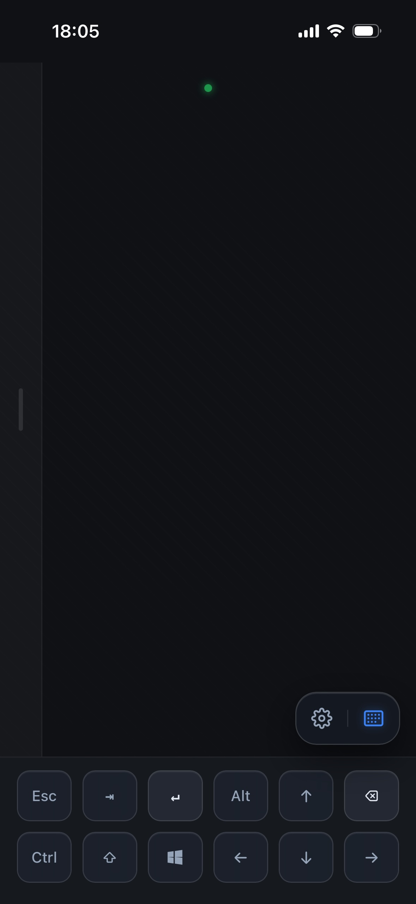
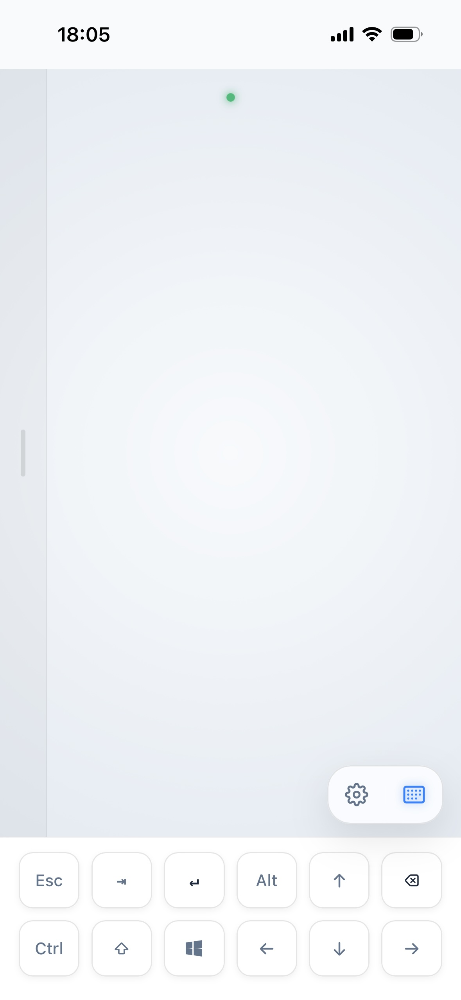
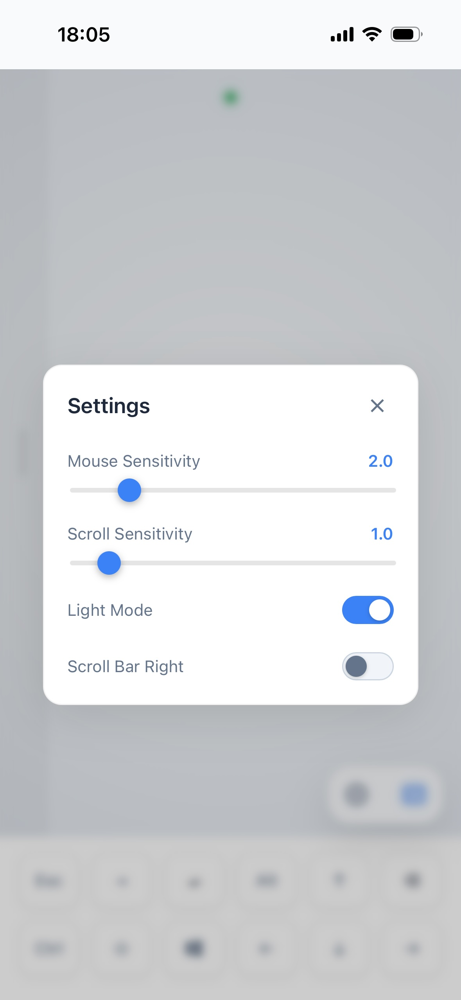

#  Remote Mouse

[English](../README.md) | [简体中文](README_ZH.md)

<p align="center">
  
</p>

<p align="center">
  
  
  
</p>

---

Remote Mouse 是一款轻量级、低延迟的远程控制工具，可将您的移动设备（iOS/Android）转变为电脑（Windows/macOS/Linux）的无线触摸板和键盘。

### 功能特性

- **PWA 支持**: 可将 Web 客户端作为原生应用安装到手机，享受全屏操作体验。
- **自动发现**: 使用 mDNS 技术自动发现局域网内的服务器。
- **灵敏触摸板**: 低延迟光标控制，支持灵敏度调节。
- **全键盘输入**: 支持文本输入、功能键（Esc、Tab、Enter）以及修饰键（Ctrl、Alt、Shift、Win）。
- **现代 UI**: 采用深色模式和精致的半透明毛玻璃视觉设计。
- **跨平台**: 服务端基于 Python，客户端可在任何现代移动浏览器中运行。

### 下载与运行

请前往 [Releases](https://github.com/rust17/remote-mouse/releases) 页面下载最新版本。

#### Windows

1. 下载以 `-setup.exe` 结尾的安装包，安装后从开始菜单打开 **Remote Mouse**。
2. 想免安装使用，可下载 `-portable.zip`，完整解压后运行 `RemoteMouse.exe`。不要单独移走其中的文件。
3. 防火墙询问时，允许专用网络访问。只有控制以管理员身份运行的应用时，才需要以管理员身份启动 Remote Mouse。

#### macOS

1. 根据电脑型号下载 DMG：**M 系列芯片**选名称含 `macos-arm64` 的文件，**Intel 芯片**选 `macos-x86_64`。
2. 打开 DMG，将 `RemoteMouse.app` 拖入 Applications，再打开应用。图标会出现在菜单栏。
3. 在 **系统设置 > 隐私与安全性 > 辅助功能** 中添加并启用 RemoteMouse，允许它控制鼠标和键盘。

应用尚未使用 Apple 开发者证书签名或完成公证。若首次打开被拦截，请确认下载来源，再到 **隐私与安全性** 中允许打开。

#### Linux

1. 下载以 `linux-x86_64.tar.gz` 结尾的压缩包，完整解压。
2. 运行 `./RemoteMouse/RemoteMouse`。需要使用 **X11** 桌面，不支持 Wayland；系统依赖见包内 `README.txt`。
3. Linux 托盘没有右键菜单。需要重启服务时，关闭并重新运行程序；可用 `--port` 设置端口、`--log` 开启日志。

### 自己打包

安装 **Node.js 22、uv 和 Python 3.13** 后，在仓库根目录运行：

```bash
uv run --frozen --project server python packaging/build.py
```

打包结果在 `packaging/out/<平台>-<架构>/products/`。各平台需要的工具和发布步骤见[打包指南](../packaging/README.md)。

---

### 使用方法

1. 在电脑上启动服务端。
2. 确保您的手机和电脑处于 **同一局域网（Wi-Fi）** 下。
3. 获取访问地址：
   - 推荐地址：**http://remote-mouse.local:9997**
   - 备选地址：使用电脑的 IP，例如 `http://192.168.1.10:9997`。IP 可在系统网络设置中查看，Windows/macOS 也可从托盘菜单查看。
4. 在手机浏览器中打开该地址。
5. (可选) 点击“添加到主屏幕”以作为 PWA 安装。
6. 开始远程控制！
